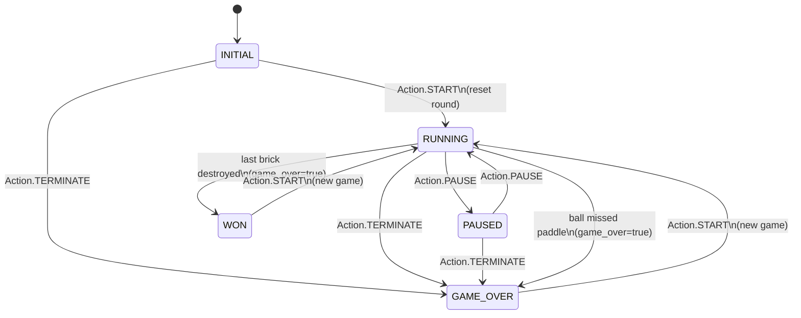

## Диаграмма конечного автомата (Арканоид)

Ниже — диаграмма КА для `ArcanoidGame` из `src/brick_game/arcanoid/engine.py`.

### Подсостояние “мяч не выпущен”

Внутри состояния `RUNNING` есть дополнительный флаг `ball_released`:

- **`ball_released = false`**: мяч “приклеен” к платформе и следует за ней при `LEFT/RIGHT`.
- **`ball_released = true`**: физика мяча обновляется на каждом `update_current_state()`.

Переход `ball_released: false -> true` происходит при:
- `Action.ACTION` или `Action.UP` (в состоянии `RUNNING`).

