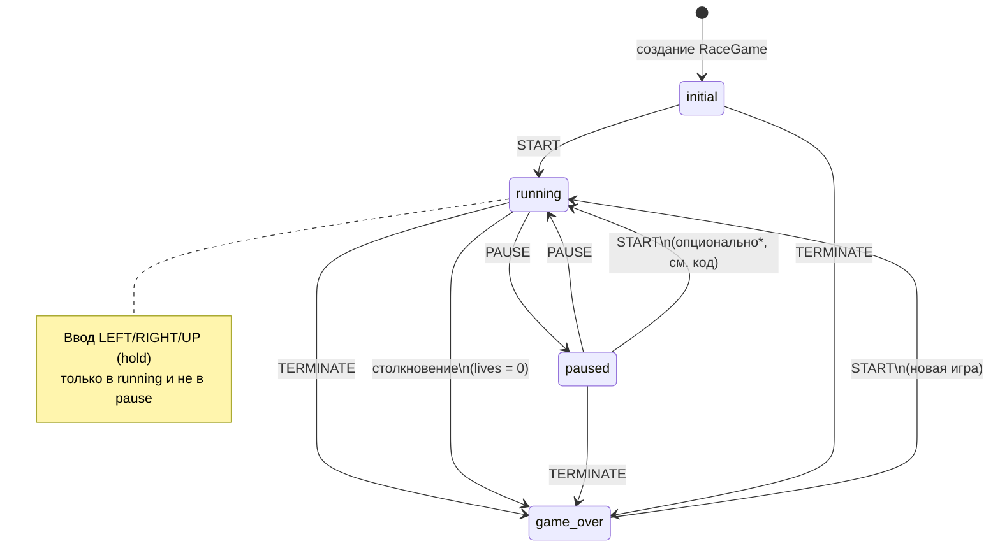
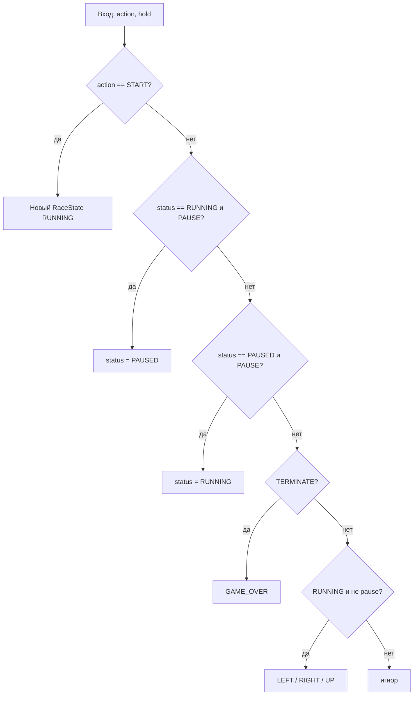

# Конечный автомат игры «Гонки» (BrickGame v3.0)

## Состояния

| Состояние   | Описание                          |
|------------|-----------------------------------|
| `initial`  | Игра создана, до нажатия «Старт»  |
| `running`  | Идёт игра, тики симуляции активны |
| `paused`   | Пауза, поле не обновляется        |
| `game_over`| Конец игры (проигрыш / выход)     |

## Переходы

- **START** — из любого состояния при действии `Action.START`: новая сессия → `running`, сброс поля (рекорд `high_score` сохраняется).
- **PAUSE** из `running` → `paused`.
- **PAUSE** из `paused` → `running`.
- **TERMINATE** → `game_over`.
- **Столкновение** при `lives <= 0` после обработки удара → `game_over`.

\*В текущей реализации `Action.START` полностью сбрасывает состояние в `RaceState(..., RUNNING)` и работает из любого статуса, включая `paused` и `game_over`.

## Упрощённая блок-схема обработки ввода

